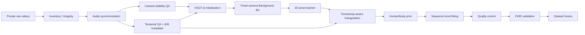

# Exercise3D Dataset Pipeline

이 저장소는 실제 Exercise3D 원본 데이터를 배포하는 저장소가 아니라, 동기화된
멀티뷰 운동 영상으로부터 고품질 3D human/body pseudo-label을 생성하기 위한 데이터셋
구축 파이프라인과 검증 절차를 공개하는 저장소입니다.

원본 영상, 얼굴을 포함할 수 있는 프레임, 개인정보, checkpoint 및 대용량 geometry
payload는 공개하지 않습니다. 저장소에는 재현 가능한 코드, 방법론, QA 기준, 비식별
수치 요약 및 synthetic schema example만 둡니다.

## 프로젝트 목표

고정된 3대의 카메라로 촬영한 운동 영상을 입력으로 받아 다음 정보를 신뢰도와 함께
만드는 end-to-end 연구 파이프라인을 구축합니다.

- video provenance와 synchronization metadata
- fixed-camera geometry와 uncertainty
- 고품질 2D keypoint observation
- timestamp-aware multi-view 3D joint
- temporal human/body prior와 sequence-level body fitting
- frame/sequence별 pseudo-label reliability
- 최종 데이터셋 schema와 정량 validation

이 파이프라인의 출력은 특정 downstream exercise posture model에 종속되지 않습니다.

## 전체 구조



원본 RGB를 다시 보간하거나 덮어쓰지 않습니다. temporal correction은 downstream
frame pairing 또는 2D trajectory 수준에서만 사용하고, geometry initialization과 최종
camera calibration을 구분합니다.

## 현재 진행 상태

| Phase | 상태 | 핵심 결과 |
|---|---|---|
| 0. Dataset Inventory / Integrity | DONE | 3명, 26 sequences, raw/sync 각 78 videos, working JPEG 65,595장, inventory PASS |
| 1. EIS/OIS / Camera Stability Audit | DONE | 78/78 `FIXED_CAMERA_OK`, native-adjacent fit 8,087/8,087 |
| 2. Temporal Synchronization QA | DONE | PTS offset 546건, median 11.99 ms, p95 25.28 ms, max 31.38 ms |
| 3. VGGT-Ω Initialization | DONE | 26/26 sequence, 78/78 camera, 624 sampled frames, 실패 0 |
| 3G. Open3D Visual Gate | DONE | 전역 mirror/180° flip/exploding cloud 없음, 1 PASS + 3 REVIEW 대표 검사 |
| 4. Fixed-Camera Background BA Pilot | DONE | 4 sequences, PASS 2 / REVIEW 2 / FAIL 0, Stage 1/2 모두 수렴 |
| 5. Full Dataset Background BA | DONE | 26 sequences 실행 완료, Phase 5.1 후 PASS 11 / REVIEW 15 / FAIL 0, Stage 1/2 26/26 |
| 5.1. `pushup_0003` Camera Recovery | DONE | 동일 objective에서 Stage 2 budget만 확장, 322 nfev에서 수렴, `RECOVERED_REVIEW` |
| 6-0. Sapiens2-5B Environment | DONE | A100 80GB smoke PASS, 308 keypoints, peak 19.986 GiB, 4.517 s/image |
| 6-1. Sapiens2 Pose Pilot | TODO | 5B primary teacher의 소규모 multi-exercise throughput/output QA |
| 7–13 | TODO | Phase 6-1 observation gate 이후 triangulation/body pipeline 진행 |

`pushup_0003`은 Phase 5.1에서 observation, initialization, objective와 gate를 그대로 두고
Stage 2 budget만 300에서 600으로 확장했습니다. 실제 322 evaluations에서 `xtol`로 수렴했고,
제한된 sparse support 때문에 `RECOVERED_REVIEW`로 유지합니다. Dataset-level FAIL은 0이며
camera geometry freeze는 REVIEW uncertainty 전파 조건으로 승인되었습니다.

세부 상태와 acceptance gate는 [plan.md](plan.md), 시간순 실행 기록은
[process.md](process.md)를 기준으로 합니다.

## 데이터 개요

- 피험자: 3명(저장소에는 비식별 aggregate만 기록)
- 구성: 26 synchronized triple-view sequences, camera 3대
- 카메라: `cam1` iPhone 16, `cam2` iPhone 16 Pro, `cam3` iPhone 17
- source rate: 30/30/60 fps 혼재, 60 fps 원본 보존
- working derivative: 30 fps

영상과 frame은 Git 이력이 아니라 private dataset storage에서 관리합니다. 공개 수치는
[metadata/results](metadata/results)에 있으며, 정확한 camera payload는 포함하지 않습니다.

## 설치

Python 3.10 이상과 `ffmpeg`/`ffprobe`가 필요합니다.

```bash
python -m venv .venv
source .venv/bin/activate
pip install -r requirements.txt
```

Open3D viewer는 환경에 맞는 Open3D를 별도로 설치합니다.

```bash
pip install open3d
```

VGGT-Ω는 공식 구현과 사용 권한이 있는 local checkpoint를 별도로 준비해야 합니다.
이 저장소는 checkpoint를 다운로드하거나 재배포하지 않습니다. PyTorch/CUDA dependency도
공식 VGGT-Ω 환경을 우선합니다.

Sapiens2 Pose 5B는 Python 3.12/PyTorch 2.7 이상을 요구하므로 Phase 0–5 환경과 분리합니다.
검증된 dependency와 checkpoint hash는
[configs/sapiens2_pose_5b_environment.json](configs/sapiens2_pose_5b_environment.json),
설치·smoke 절차는 [Phase 6 문서](docs/phases/phase_6_sapiens2.md)에 기록했습니다.

## 외부 private dataset 연결

경로를 코드에 하드코딩하지 않습니다. CLI 또는 환경변수로 private root를 주입합니다.

```bash
export EXERCISE3D_DATASET_ROOT=/path/to/private/exercise3d
export EXERCISE3D_VGGT_REPO=/path/to/local/vggt-omega
export EXERCISE3D_VGGT_CHECKPOINT=/path/to/checkpoints/vggt_omega_1b_512.pt
```

[configs/paths.example.env](configs/paths.example.env)를 참고하십시오. 외부 dataset을
read-only source로 사용할 때는 `--output-dir` 또는 `--output-root`를 이 저장소의 ignored
`outputs/` 아래로 명시해야 합니다.

## 주요 실행 예

Phase 0 inventory:

```bash
python tools/dataset_inventory.py \
  --dataset-root "$EXERCISE3D_DATASET_ROOT" \
  --output-dir outputs/local/inventory
```

Phase 1 camera stability QA:

```bash
python tools/eis_background_audit.py \
  --dataset-root "$EXERCISE3D_DATASET_ROOT" \
  --output-dir outputs/local/eis_audit
```

Phase 2 temporal QA:

```bash
python tools/temporal_sync_audit.py \
  --dataset-root "$EXERCISE3D_DATASET_ROOT" \
  --output-dir outputs/local/temporal_alignment
```

Phase 3 VGGT-Ω initialization:

```bash
python tools/vggt_geometry_init.py \
  --dataset-root "$EXERCISE3D_DATASET_ROOT" \
  --vggt-repo "$EXERCISE3D_VGGT_REPO" \
  --checkpoint "$EXERCISE3D_VGGT_CHECKPOINT" \
  --output-dir outputs/local/vggt
```

VGGT/Open3D inspection:

```bash
python tools/visualize_vggt.py \
  --dataset-root "$EXERCISE3D_DATASET_ROOT" \
  --vggt-output outputs/local/vggt \
  --sequence squat_0001 \
  --confidence-preset top50
```

Fixed-camera Background BA dry-run:

```bash
python tools/background_bundle_adjust.py \
  --dataset-root "$EXERCISE3D_DATASET_ROOT" \
  --vggt-root outputs/local/vggt \
  --output-root outputs/local/background_ba \
  --sequence squat_0001 \
  --dry-run
```

Phase 5에서 실제 사용한 수치 default는
[configs/phase5_background_ba.json](configs/phase5_background_ba.json)에 freeze했습니다.

Sapiens2 Pose 5B single-image smoke:

```bash
"$EXERCISE3D_SAPIENS2_PYTHON" tools/sapiens2_pose_smoke.py \
  --image <PRIVATE_REPRESENTATIVE_FRAME> \
  --sapiens2-root "$SAPIENS2_ROOT" \
  --checkpoint-root "$EXERCISE3D_CHECKPOINT_ROOT" \
  --output-json outputs/local/sapiens2/smoke.json
```

## 도구

| 파일 | 역할 | source mutation |
|---|---|---|
| `scripts/sync_videos.py` | clap/audio 기반 영상 synchronization | 새 derivative 생성 |
| `scripts/build_dataset.py` | sync/frame/manifest orchestration | 지정 output에만 생성 |
| `tools/dataset_inventory.py` | raw/sync/frame provenance inventory | 없음 |
| `tools/eis_background_audit.py` | fixed-camera stability 분석 | 없음 |
| `tools/temporal_sync_audit.py` | PTS/audio/visual offset 및 drift QA | 없음 |
| `tools/vggt_geometry_init.py` | VGGT-Ω initialization | 새 output에만 생성 |
| `tools/visualize_vggt.py` | Open3D geometry QA | optional debug output만 생성 |
| `tools/background_bundle_adjust.py` | shared physical-camera Background BA | 새 output에만 생성 |
| `tools/finalize_background_ba_dataset.py` | dataset-level BA validation/report | BA output metadata 생성 |
| `tools/analyze_background_ba_recovery.py` | Stage 2 budget-only recovery 재현·동일성 검증 | BA output metadata 생성 |
| `tools/sapiens2_pose_smoke.py` | 공식 Sapiens2 5B + DETR single-image smoke/VRAM/latency | optional ignored output만 생성 |
| `tools/check_publication_safety.py` | staged/tracked 공개 안전 검사 | 없음 |

## 저장소 구조

```text
Exercise3D-Dataset-Pipeline/
├── README.md
├── plan.md
├── process.md
├── configs/
├── docs/
│   ├── phases/
│   ├── design/
│   └── qa/
├── scripts/
├── tools/
├── examples/
├── metadata/results/
└── outputs/example/
```

## QA 원칙

1. raw, synchronized video, working frame은 immutable source로 취급합니다.
2. frame index보다 PTS provenance를 우선합니다.
3. model prediction은 ground truth가 아니라 noisy observation/prior입니다.
4. fixed physical camera마다 최종 pose 변수는 하나만 둡니다.
5. 사람과 움직이는 장비는 Background BA static track에서 제거합니다.
6. 단일 pixel threshold가 아니라 support, residual, pose plausibility, uncertainty와 visual
   coherence를 함께 평가합니다.
7. `REVIEW`와 `FAIL`을 숨기지 않고 downstream에 전달합니다.
8. Phase acceptance gate를 통과하기 전에는 다음 대규모 단계로 진행하지 않습니다.

## 개인정보와 데이터 제공

GitHub에는 다음을 올리지 않습니다.

- raw/synchronized video, 추출 frame, 얼굴을 포함한 screenshot
- 개인정보, GPS/geolocation 및 식별 가능한 metadata
- depth/point map/feature/track/checkpoint와 대용량 pseudo-label payload
- 제3자 pretrained weight

자세한 정책은 [docs/design/privacy_and_data_policy.md](docs/design/privacy_and_data_policy.md)를
참고하십시오. commit 전 다음 검사를 수행합니다.

```bash
git add <명시적 파일 목록>
python tools/check_publication_safety.py
git diff --cached --stat
git diff --cached
```

## Pretrained model dependency

- VGGT-Ω: camera/depth/point-map initialization 전용, 최종 camera로 직접 사용하지 않음
- Sapiens2 Pose 5B: Phase 6 primary offline 2D teacher로 확정; official DETR person detector 사용
- SAM 3D Body / SAM-Body4D: Phase 8 pretrained temporal body prior 후보
- Fit3D: Phase 12 정량 validation dataset 후보

각 모델의 라이선스, 배포 조건, checkpoint 사용 권한은 upstream 정책을 따릅니다.

## 라이선스와 인용

현재 저장소는 정식 오픈소스 라이선스 선택 전 단계이며, 기본적으로 모든 권리를
보유합니다. `LICENSE`와 각 third-party upstream license를 확인하십시오. 논문/데이터셋
citation 정보는 final dataset freeze 시 추가할 예정입니다.
