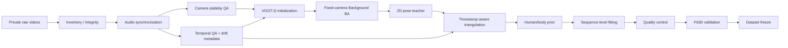

# Exercise3D Dataset Pipeline

이 저장소는 실제 Exercise3D 원본 데이터를 배포하는 저장소가 아니라, 동기화된
멀티뷰 운동 영상으로부터 고품질 3D human/body pseudo-label을 생성하기 위한 데이터셋
구축 파이프라인과 검증 절차를 공개하는 저장소입니다.

원본 영상, 얼굴을 포함할 수 있는 프레임, 개인정보, checkpoint 및 대용량 geometry
payload는 공개하지 않습니다. 저장소에는 재현 가능한 코드, 방법론, QA 기준, 비식별
수치 요약 및 synthetic schema example만 둡니다.

장시간 generation을 이어받는 agent는 다른 문서보다 먼저
[`HANDOFF.md`](HANDOFF.md)를 읽습니다. 실시간 private command/PID/progress는 Git에서 제외된
`.runtime/handoff_state.json`에 30초 간격으로 atomic 저장되며, 살아 있는 inference를 중복
실행하지 않는 startup 순서는 [`AGENTS.md`](AGENTS.md)에 고정했습니다.
사람용 live dashboard와 machine-readable attention state는
`tools/monitor_autonomous_generation.py`가 `.runtime/dashboard_state.json`에 atomic 저장합니다.
완료된 expensive camera output에는 checkpoint/config/source/selection/tool/command identity를
담은 `run_provenance.json`을 별도 atomic sidecar로 남깁니다.
고정 deadline에는 별도 private snapshot build가 현재 PASS/REVIEW/FAIL/INCOMPLETE 상태를 보존하며,
장기 generation 자체는 snapshot 이후에도 중단하지 않습니다.

## 프로젝트 목표

고정된 3대의 카메라로 촬영한 운동 영상을 입력으로 받아 다음 정보를 신뢰도와 함께
만드는 end-to-end 연구 파이프라인을 구축합니다.

- video provenance와 synchronization metadata
- fixed-camera geometry와 uncertainty
- 고품질 2D keypoint observation
- timestamp-aware multi-view 3D joint
- temporal human/body prior와 sequence-level body fitting
- frame/sequence별 pseudo-label reliability
- 최종 데이터셋 schema와 정량 validation

이 파이프라인의 출력은 특정 downstream exercise posture model에 종속되지 않습니다.

## 전체 구조



원본 RGB를 다시 보간하거나 덮어쓰지 않습니다. temporal correction은 downstream
frame pairing 또는 2D trajectory 수준에서만 사용하고, geometry initialization과 최종
camera calibration을 구분합니다.

## 현재 진행 상태

| Phase | 상태 | 핵심 결과 |
|---|---|---|
| 0. Dataset Inventory / Integrity | DONE | 3명, 26 sequences, raw/sync 각 78 videos, working JPEG 65,595장, inventory PASS |
| 1. EIS/OIS / Camera Stability Audit | DONE | 78/78 `FIXED_CAMERA_OK`, native-adjacent fit 8,087/8,087 |
| 2. Temporal Synchronization QA | DONE | PTS offset 546건, median 11.99 ms, p95 25.28 ms, max 31.38 ms |
| 3. VGGT-Ω Initialization | DONE | 26/26 sequence, 78/78 camera, 624 sampled frames, 실패 0 |
| 3G. Open3D Visual Gate | DONE | 전역 mirror/180° flip/exploding cloud 없음, 1 PASS + 3 REVIEW 대표 검사 |
| 4. Fixed-Camera Background BA Pilot | DONE | 4 sequences, PASS 2 / REVIEW 2 / FAIL 0, Stage 1/2 모두 수렴 |
| 5. Full Dataset Background BA | DONE | 26 sequences 실행 완료, Phase 5.1 후 PASS 11 / REVIEW 15 / FAIL 0, Stage 1/2 26/26 |
| 5.1. `pushup_0003` Camera Recovery | DONE | 동일 objective에서 Stage 2 budget만 확장, 322 nfev에서 수렴, `RECOVERED_REVIEW` |
| 6-0. Sapiens2-5B Environment | DONE | A100 80GB smoke PASS, 308 keypoints, peak 19.986 GiB, 4.517 s/image |
| 6-1. Sapiens2 Pose Pilot | DONE | all-person baseline 보존, batch 1/2/4/8/12/16 완료 |
| 6-1A. Primary Target Selection | DONE | 9,732 frame, identity switch 0, ambiguity 7, crop 50.37% 감소 |
| 6-2. Target-only Runtime Gate | RUNNING | full selector `GO_FULL_DATASET`; 78 view/65,595 frame, target 65,430, identity/integrity failure 0; 5B batch 16 실행 중 |
| 7. Timestamp-aware Triangulation | RUNNING | pilot 4/4 final schema PASS; pose-complete sequence CPU streaming, NO_GO에만 held-out recovery |
| 8. SAM Body Runtime Feasibility | FULL RUNNING/REVIEW | 22.387 GiB integrity PASS, A/B/C 6-run 완료; Mode B 2 sequence/5,571 frame PASS |
| 9. Sequence Body Fitting | RUNNING/REVIEW | 2 sequence 완료; schema PASS, camera/displacement REVIEW 2/FAIL 0 |
| 10. Body Shape / Proportion | IMPLEMENTED PARTIAL | sequence-level shape/scale provenance 보존; evidence-backed subject mapping 부재로 cross-sequence fusion 안 함 |
| 11. Pseudo-label Quality Control | RUNNING | 10 sequence/6,485 frame, REVIEW 10/FAIL 0; source-specific vector/bitmask, scalar accuracy score 없음 |
| 12. Fit3D Validation | IMPLEMENTED/WAITING DATA | metric regression PASS; local Fit3D payload 부재로 실제 score 미주장 |
| 13. Final Dataset Freeze | IMPLEMENTED/SMOKE PASS | 34-file immutable smoke integrity PASS; deadline build 입력 누적 중 |

`pushup_0003`은 Phase 5.1에서 observation, initialization, objective와 gate를 그대로 두고
Stage 2 budget만 300에서 600으로 확장했습니다. 실제 322 evaluations에서 `xtol`로 수렴했고,
제한된 sparse support 때문에 `RECOVERED_REVIEW`로 유지합니다. Dataset-level FAIL은 0이며
camera geometry freeze는 REVIEW uncertainty 전파 조건으로 승인되었습니다.

2026-08-14 13:00 KST deadline을 기준으로 full target-only Sapiens2 projection과 SAM을 한
A100에서 모두 순차 실행하는 것은 불가능합니다. 따라서 5B/flip-test/abstention을 유지한 채
기존 pilot output을 lossless하게 재사용하고, shortest-first resumable sequence 처리와 CPU QA를
병행합니다. 미완료 항목은 `INCOMPLETE_DEADLINE` provenance로 남기며 PASS로 위장하지 않습니다.

Phase 7 pilot에서는 2D target이 정상인데도 `squat_0001`과 `pushup_0001`의 current camera와
epipolar consistency가 무너지는 새 evidence가 확인됐습니다. 해당 3D proposal은 fitting/export에서
제외했고, 원본 Phase 5 camera를 덮어쓰지 않는 recovery와 held-out 검증을 요구합니다.
자세한 내용은 [Phase 7 문서](docs/phases/phase_7_triangulation.md)에 있습니다.

Phase 8 primary-target pilot는 control/severe 두 clip의 Mode A/B/C 여섯 run을 완료했습니다.
SAM full-stage projection은 16.35/20.80/32.63시간, Sapiens2 target-only와 한 GPU에서 순차
실행하는 합계는 95.43/99.88/111.71시간입니다. Mode C는 약 2배 느렸지만 이번 severe clip에서
content completion이 호출되지 않아 선택적 refiner 정책은 `REVIEW`로 유지합니다. full 기본은
Mode B이며 Mode C는 evidence가 있는 frame/sequence만 selective escalation합니다. 상세 근거는
[Phase 8 문서](docs/phases/phase_8_sam_body4d.md)에 있습니다.

Full inference가 진행되는 동안 CPU에서는 세 view가 완결된 sequence부터 Phase 7을 자동 실행합니다.
SAM compact prior는 MHR pose/shape/hand/expression/joint/model parameter와 source PTS를 보존하며,
Phase 9는 triangulated geometry를 dominant observation으로 두는 staged fit만 허용합니다. 최종 private
export는 source RGB를 포함하지 않고 stage payload의 byte equality와 SHA-256, PASS/REVIEW/FAIL/
INCOMPLETE 상태를 versioned manifest에 기록합니다.

첫 end-to-end `barbellrow_0000`은 Mode B 3-view 1,770 frame과 body fit 590 timestamp × 26 joint를
완료했습니다. Numeric/mesh/provenance와 finite/NaN contract는 PASS했지만 camera REVIEW와 normalized
geometry displacement p95 0.05167을 그대로 전파해 sequence는 `REVIEW_BODY_FIT_QUALITY`입니다.
Complete sequence 하나만 사용한 private export smoke는 34 files의 size/SHA-256 불일치 없이
freeze-eligible이었으며, REVIEW를 PASS로 승격하지 않았습니다.

두 번째 `squat_0001`도 Mode B 3-view 3,801/3,801 frame과 1,267×26 body fit을 완료했습니다.
Body fit coverage/alignment는 1.0이고 prior-only joint는 0이지만 normalized displacement p95
0.07936과 camera uncertainty를 전파해 REVIEW로 유지합니다. Mode C 후보는 0으로
`PASS_MODE_B_FROZEN`이며 expensive Mode C를 실행하지 않았습니다.

현재 장기 supervisor는 실행 중인 5B PID를 기다리고, 불완전 종료 시 동일 selection-bound 설정으로
resume한 뒤 Phase 7 → SAM Mode B → prior consolidation → body fit → private export를 sequence별로
이어갑니다. Full SAM 직전에는 8-frame Mode B smoke로 PTS/mesh/MHR numeric schema를 실제 GPU에서
검사합니다. Mode C는 자동 full mode가 아니며
[`configs/sam_mode_c_escalation.json`](configs/sam_mode_c_escalation.json)의 occlusion+failure/outlier
조건과 B/C 개선 gate를 모두 통과할 때만 선택 후보입니다.
각 full Mode B sequence 뒤에는 이 조건을 실제로 평가해 후보 frame/clip 또는
`PASS_MODE_B_FROZEN`을 private export provenance에 포함합니다.

세부 상태와 acceptance gate는 [plan.md](plan.md), 시간순 실행 기록은
[process.md](process.md)를 기준으로 합니다.

## 데이터 개요

- 피험자: 3명(저장소에는 비식별 aggregate만 기록)
- 구성: 26 synchronized triple-view sequences, camera 3대
- 카메라: `cam1` iPhone 16, `cam2` iPhone 16 Pro, `cam3` iPhone 17
- source rate: 30/30/60 fps 혼재, 60 fps 원본 보존
- working derivative: 30 fps

영상과 frame은 Git 이력이 아니라 private dataset storage에서 관리합니다. 공개 수치는
[metadata/results](metadata/results)에 있으며, 정확한 camera payload는 포함하지 않습니다.

## 설치

Python 3.10 이상과 `ffmpeg`/`ffprobe`가 필요합니다.

```bash
python -m venv .venv
source .venv/bin/activate
pip install -r requirements.txt
```

Open3D viewer는 환경에 맞는 Open3D를 별도로 설치합니다.

```bash
pip install open3d
```

VGGT-Ω는 공식 구현과 사용 권한이 있는 local checkpoint를 별도로 준비해야 합니다.
이 저장소는 checkpoint를 다운로드하거나 재배포하지 않습니다. PyTorch/CUDA dependency도
공식 VGGT-Ω 환경을 우선합니다.

Sapiens2 Pose 5B는 Python 3.12/PyTorch 2.7 이상을 요구하므로 Phase 0–5 환경과 분리합니다.
검증된 dependency와 checkpoint hash는
[configs/sapiens2_pose_5b_environment.json](configs/sapiens2_pose_5b_environment.json),
설치·smoke 절차는 [Phase 6 문서](docs/phases/phase_6_sapiens2.md)에 기록했습니다.

## 외부 private dataset 연결

경로를 코드에 하드코딩하지 않습니다. CLI 또는 환경변수로 private root를 주입합니다.

```bash
export EXERCISE3D_DATASET_ROOT=/path/to/private/exercise3d
export EXERCISE3D_VGGT_REPO=/path/to/local/vggt-omega
export EXERCISE3D_VGGT_CHECKPOINT=/path/to/checkpoints/vggt_omega_1b_512.pt
```

[configs/paths.example.env](configs/paths.example.env)를 참고하십시오. 외부 dataset을
read-only source로 사용할 때는 `--output-dir` 또는 `--output-root`를 이 저장소의 ignored
`outputs/` 아래로 명시해야 합니다.

## 주요 실행 예

Phase 0 inventory:

```bash
python tools/dataset_inventory.py \
  --dataset-root "$EXERCISE3D_DATASET_ROOT" \
  --output-dir outputs/local/inventory
```

Phase 1 camera stability QA:

```bash
python tools/eis_background_audit.py \
  --dataset-root "$EXERCISE3D_DATASET_ROOT" \
  --output-dir outputs/local/eis_audit
```

Phase 2 temporal QA:

```bash
python tools/temporal_sync_audit.py \
  --dataset-root "$EXERCISE3D_DATASET_ROOT" \
  --output-dir outputs/local/temporal_alignment
```

Phase 3 VGGT-Ω initialization:

```bash
python tools/vggt_geometry_init.py \
  --dataset-root "$EXERCISE3D_DATASET_ROOT" \
  --vggt-repo "$EXERCISE3D_VGGT_REPO" \
  --checkpoint "$EXERCISE3D_VGGT_CHECKPOINT" \
  --output-dir outputs/local/vggt
```

VGGT/Open3D inspection:

```bash
python tools/visualize_vggt.py \
  --dataset-root "$EXERCISE3D_DATASET_ROOT" \
  --vggt-output outputs/local/vggt \
  --sequence squat_0001 \
  --confidence-preset top50
```

Fixed-camera Background BA dry-run:

```bash
python tools/background_bundle_adjust.py \
  --dataset-root "$EXERCISE3D_DATASET_ROOT" \
  --vggt-root outputs/local/vggt \
  --output-root outputs/local/background_ba \
  --sequence squat_0001 \
  --dry-run
```

Phase 5에서 실제 사용한 수치 default는
[configs/phase5_background_ba.json](configs/phase5_background_ba.json)에 freeze했습니다.

Sapiens2 Pose 5B single-image smoke:

```bash
"$EXERCISE3D_SAPIENS2_PYTHON" tools/sapiens2_pose_smoke.py \
  --image <PRIVATE_REPRESENTATIVE_FRAME> \
  --sapiens2-root "$SAPIENS2_ROOT" \
  --checkpoint-root "$EXERCISE3D_CHECKPOINT_ROOT" \
  --output-json outputs/local/sapiens2/smoke.json
```

## 도구

| 파일 | 역할 | source mutation |
|---|---|---|
| `scripts/sync_videos.py` | clap/audio 기반 영상 synchronization | 새 derivative 생성 |
| `scripts/build_dataset.py` | sync/frame/manifest orchestration | 지정 output에만 생성 |
| `tools/dataset_inventory.py` | raw/sync/frame provenance inventory | 없음 |
| `tools/eis_background_audit.py` | fixed-camera stability 분석 | 없음 |
| `tools/temporal_sync_audit.py` | PTS/audio/visual offset 및 drift QA | 없음 |
| `tools/vggt_geometry_init.py` | VGGT-Ω initialization | 새 output에만 생성 |
| `tools/visualize_vggt.py` | Open3D geometry QA | optional debug output만 생성 |
| `tools/background_bundle_adjust.py` | shared physical-camera Background BA | 새 output에만 생성 |
| `tools/finalize_background_ba_dataset.py` | dataset-level BA validation/report | BA output metadata 생성 |
| `tools/analyze_background_ba_recovery.py` | Stage 2 budget-only recovery 재현·동일성 검증 | BA output metadata 생성 |
| `tools/sapiens2_pose_smoke.py` | 공식 Sapiens2 5B + DETR single-image smoke/VRAM/latency | optional ignored output만 생성 |
| `tools/sapiens2_pose_pipeline.py` | all-person 5B batch benchmark와 resumable baseline pilot | ignored output만 생성 |
| `tools/detr_person_candidates.py` | explicit sequence allowlist의 official DETR detection-only pass | ignored private output만 생성 |
| `tools/target_subject_selection.py` | all DETR candidate 보존 + bidirectional primary target tracking | ignored private output + aggregate report |
| `tools/sapiens2_target_pipeline.py` | accepted target-only 5B batch benchmark/inference/verification | ignored output만 생성 |
| `tools/validate_target_selection_full.py` | DETR candidate lossless 보존·identity/abstention full gate | ignored aggregate 생성 |
| `tools/summarize_phase6_1.py` | all-person/target-only 비교, ETA와 acceptance gate 집계 | redacted aggregate 생성 |
| `tools/triangulate_sapiens2.py` | PTS-aware weighted triangulation과 pose-camera consistency gate | ignored private output 생성 |
| `tools/recover_cameras_from_pose_observations.py` | NO_GO camera의 별도 observation-conditioned/held-out recovery | ignored private output 생성 |
| `tools/run_phase7_streaming.py` | pose-complete sequence의 triangulation/recovery 자동 streaming | ignored private output 생성 |
| `tools/benchmark_sam_body4d.py` | SAM-Body4D checkpoint preflight와 refiner on/off runtime 측정 | ignored output만 생성 |
| `tools/sam_body_primary_target_runner.py` | primary bbox 1개 adapter와 compact MHR parameter provenance 저장 | ignored private output만 생성 |
| `tools/run_sam_body4d_full.py` | Mode B camera 단위 resume/completeness orchestration | ignored private output만 생성 |
| `tools/run_autonomous_generation.py` | Sapiens resume부터 Phase 7–13까지 장시간 critical path supervision | ignored private output 생성 |
| `tools/monitor_autonomous_generation.py` | 기존 runtime/process/GPU를 읽는 live dashboard와 atomic attention state | ignored `.runtime/dashboard_state.json` 생성 |
| `tools/consolidate_sam_body_prior.py` | frame/PTS/identity-aware MHR numeric prior 통합 | ignored private output 생성 |
| `tools/assess_sam_mode_c_escalation.py` | Mode B failure/outlier 기반 bounded Mode C review clip 선정 | ignored private output 생성 |
| `tools/verify_mhr_parameter_replay.py` | compact 204-d MHR parameter의 official model exact replay 검사 | ignored aggregate 생성 |
| `tools/fit_sequence_body.py` | geometry-dominant staged sequence body fit과 S0 | ignored private output 생성 |
| `tools/build_pseudolabel_quality.py` | target/pose/SAM/geometry/body evidence의 frame/sequence quality vector | ignored private output 생성 |
| `tools/run_quality_control_follower.py` | 완료 body-fit을 감지하는 CPU-only Phase 11 follower | ignored runtime/quality output 갱신 |
| `tools/export_private_dataset.py` | versioned private dataset export와 byte/SHA/schema 검증 | ignored private output 생성 |
| `tools/evaluate_fit3d_metrics.py` | prepared Fit3D pair의 MPJPE/N-MPJPE/PA-MPJPE 분리 평가 | ignored aggregate 생성 |
| `tools/summarize_sam_body_runtime.py` | A/B/C ratio, occlusion 증가와 best/expected/worst runtime 집계 | redacted aggregate 생성 |
| `tools/check_publication_safety.py` | staged/tracked 공개 안전 검사 | 없음 |

## 저장소 구조

```text
Exercise3D-Dataset-Pipeline/
├── README.md
├── plan.md
├── process.md
├── configs/
├── docs/
│   ├── phases/
│   ├── design/
│   └── qa/
├── scripts/
├── tools/
├── examples/
├── metadata/results/
└── outputs/example/
```

## QA 원칙

1. raw, synchronized video, working frame은 immutable source로 취급합니다.
2. frame index보다 PTS provenance를 우선합니다.
3. model prediction은 ground truth가 아니라 noisy observation/prior입니다.
4. fixed physical camera마다 최종 pose 변수는 하나만 둡니다.
5. 사람과 움직이는 장비는 Background BA static track에서 제거합니다.
6. 단일 pixel threshold가 아니라 support, residual, pose plausibility, uncertainty와 visual
   coherence를 함께 평가합니다.
7. `REVIEW`와 `FAIL`을 숨기지 않고 downstream에 전달합니다.
8. Phase acceptance gate를 통과하기 전에는 다음 대규모 단계로 진행하지 않습니다.

## 개인정보와 데이터 제공

GitHub에는 다음을 올리지 않습니다.

- raw/synchronized video, 추출 frame, 얼굴을 포함한 screenshot
- 개인정보, GPS/geolocation 및 식별 가능한 metadata
- depth/point map/feature/track/checkpoint와 대용량 pseudo-label payload
- 제3자 pretrained weight

자세한 정책은 [docs/design/privacy_and_data_policy.md](docs/design/privacy_and_data_policy.md)를
참고하십시오. commit 전 다음 검사를 수행합니다.

```bash
git add <명시적 파일 목록>
python tools/check_publication_safety.py
git diff --cached --stat
git diff --cached
```

## Pretrained model dependency

- VGGT-Ω: camera/depth/point-map initialization 전용, 최종 camera로 직접 사용하지 않음
- Sapiens2 Pose 5B: Phase 6 primary offline 2D teacher로 확정; official DETR person detector 사용
- SAM 3D Body / SAM-Body4D: checkpoint 28 files/22.387 GiB SHA-256 integrity와 primary-target
  A/B/C pilot 완료; Mode B full 기본 후보, Mode C selective 정책은 REVIEW
- Fit3D: Phase 12 정량 validation dataset 후보

각 모델의 라이선스, 배포 조건, checkpoint 사용 권한은 upstream 정책을 따릅니다.

## 라이선스와 인용

현재 저장소는 정식 오픈소스 라이선스 선택 전 단계이며, 기본적으로 모든 권리를
보유합니다. `LICENSE`와 각 third-party upstream license를 확인하십시오. 논문/데이터셋
citation 정보는 final dataset freeze 시 추가할 예정입니다.
